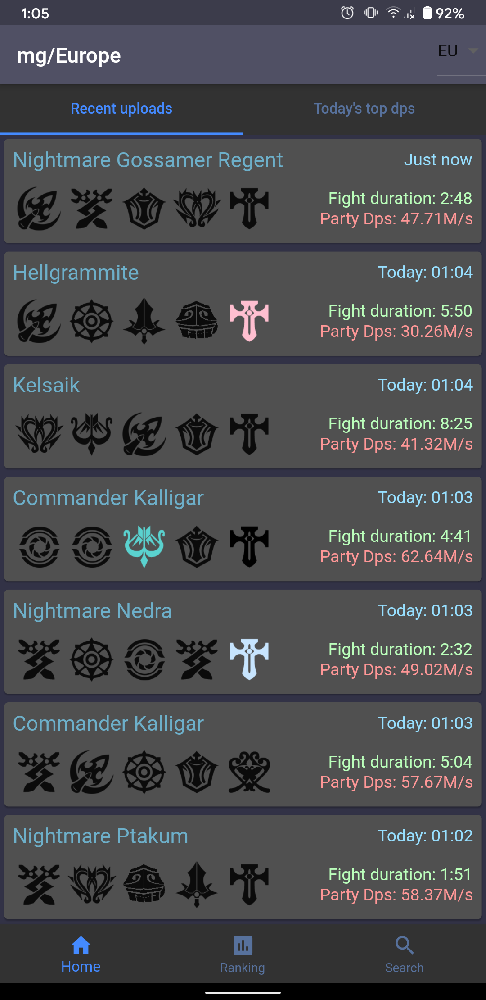
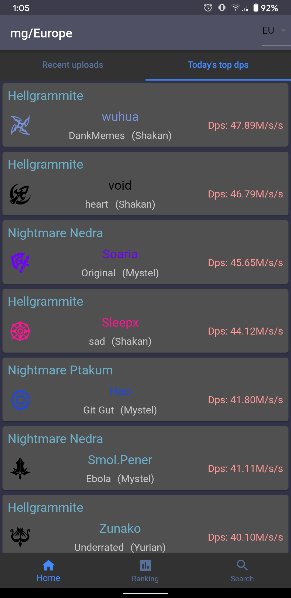
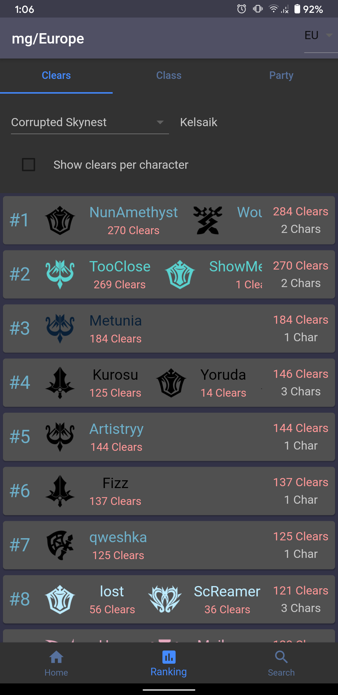
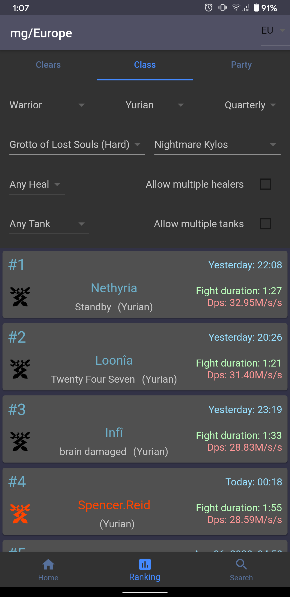
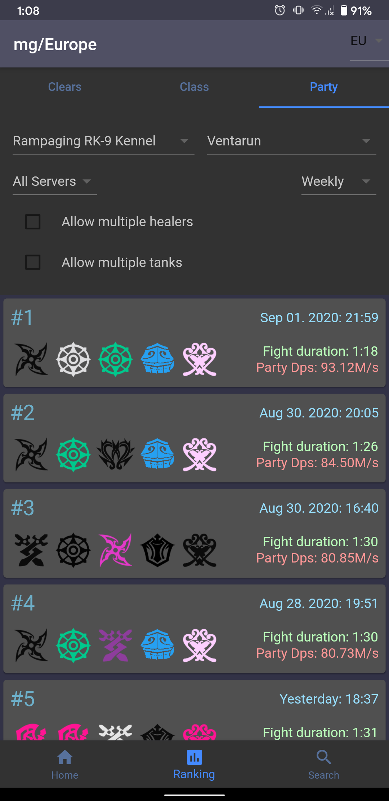
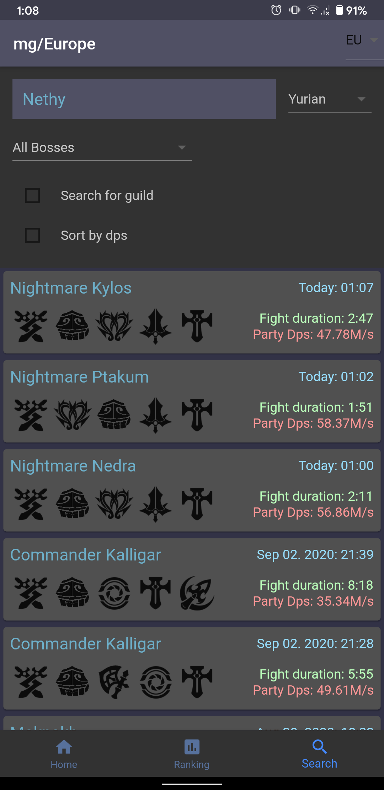

mg mobile
===
Mobile app for [moongourd](https://kabedon.moongourd.com/)

Developed and maintained by Kanjiu Akuma aka Kami-Kaze

Usage
===

App builds upon intuitive interactive design
- If a list of characters is too long its scrollable (only applies to dense view of logs or ranking)
- Drag down to refresh
- Tap an item to expand it (only for items with more than one character)
- Tap on a character to search for it

Screenshots
===

### Home

    
    

### Ranking

    
    
    

### Search

Installing
===
Head over [here](https://github.com/KanjiuAkuma/mg_mobile/releases) and download mg_mobile.apk (found under assets) from the latest release.

As the apk is not yet signed your phone might prompt you to enable `Installation of applications not obtained from the Play Store`.

Building it yourself
===

Check out the flutter examples or the documentation, which offers tutorials, samples, guidance on mobile development, 
and a full API reference if you want to build the app yourself or contribute. 

- [online documentation](https://flutter.dev/docs)
- [Lab: Write your first Flutter app](https://flutter.dev/docs/get-started/codelab)
- [Cookbook: Useful Flutter samples](https://flutter.dev/docs/cookbook)
